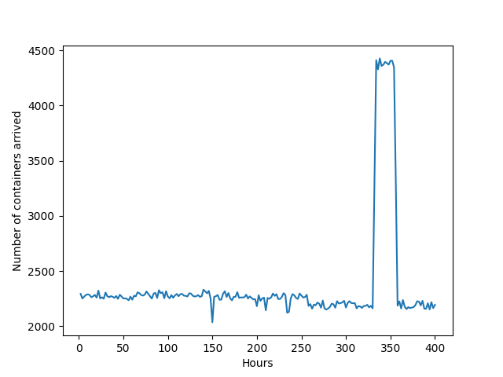
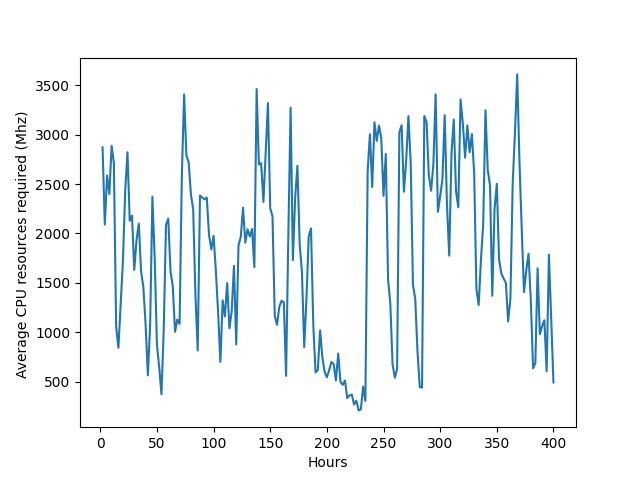

# Project Title
This repo implements paper: Energy-Aware Dynamic Resource Allocation in Container-based Clouds via Cooperative Coevolution Genetic Programming.

For details of the paper, please see EvoApplication 2023 (is accetped and appear soon)

'''
@inproceedings{wang2023energy,
  title={Energy-Aware Dynamic Resource Allocation in Container-based Clouds via Cooperative Coevolution Genetic Programming},
  author={Wang, Chen and Ma, Hui and Chen, Gang and Victoria, Huang and Yuyong, Bo and Kameron, Christopher},
  booktitle={International Conference on the Applications of Evolutionary Computation (Part of EvoStar)},
  year={2023},
  organization={Springer}
}
'''

# Getting Started
These instructions will get you a copy of the project and running on your local machine.

# Prerequisites
## Third-Party Lib

To run the source code of PMFEA-EDA, the following jar files need to be built in the path of library:

1. Java jar: JAVA_SE 14
2. Third party jars: ECJ25 and other related jars are included in the jar fold of this repository.

## New Benchmark dataset

The augmented benchmark dataset, i.e.,  Bitbrains, is created and used in this study ( provided in the project repository /data/bitbrains. 

We create warm up, training and testing data based on the original dataset. For example, in Bitbrains, first 100 two-hour data of Bitbrains are used to generate dataset for data center warm up , and the following 200 two-hour are used for training (in 200 generations), and the rest days are used for testing. Note that, 10:1 downsampling is used in Bitbrains.

We also considers  different  number of OS  types in each augmented  benchmark dataset. In particular, we consider 3 types of mixes for operation systems,  i.e., 3OS, 4OS, and 5OS. We use 3OS BitBrains, including data of PM Types, VM Types, Containers, and etc., as an example and demonstrate the data details below.

<ul>
 <li>PM Types: </li>
 <ul>
      <li>Location: /data/bitbrains/3OS/PMConfig</li>
      <li>Columns:  P_CPU(MHz), P_Memory(MB), P_idle(Wh), P_Max(Wh), P_Cores</li>
</ul>
</ul>

<ul>
 <li>VM Types: </li>
 <ul>
      <li>Location: /data/bitbrains/3OS/VMConfig</li>
      <li>Columns:  V_CPU(MHz), V_Memory(GB), V_Cores</li>
      <li>Note that the above VM types are created based on AmazonEC2 and convert cpu cores  to Mhz using an equation of VM_Mhz = PM_CPU(MHz)/ PM_Core * VM_Core. These Amazon EC2 are listed below:
</li>
</ul>
</ul>

| name            | CPU(Core)    | Memory(GB)
| --- | --- | --- |
| c5.large	    | 2	          | 4| 
| c5.xlarge	    | 4	          | 8| 
| c5.2xlarge	    | 8	          | 16| 
| c5.4xlarge	    | 16	          | 32| 
| c5.9xlarge	    | 36	          | 72| 
| c5a.8xlarge	| 32	          | 64| 
| c5a.12xlarge  | 48	          | 96| 
| c5a.16xlarge	| 64	          | 128| 

<ul>
 <li>Containers: </li>
 <ul>
      <li>Location: /data/bitbrains/3OS/containerData</li>
      <li>Columns:  C_CPU(MHz), C_Memory(GB), C_timestamp(ms)</li>
      <li>Note that we have generated m number of testCase%m%. In particular, the mth testCase is used for trainning in the mth generation.</li>
</ul>
</ul>

|          | Number of containers | Average CPU resources required | 
|----------|-------------|-------------|
| **Bitbrains** |   |   |

<ul>
 <li>OS System Associated With Containers: </li>
 <ul>
      <li>Location: /data/bitbrains/3OS/OSData</li>
      <li>Columns:  OS id</li>
</ul>
</ul>

<ul>
 <li>OS Distribution: </li>
 <ul>
      <li>Location: /data/bitbrains/3OS/OSPro</li>
      <li>Columns:  OS id</li>
      <li>Note that we consider 3, 4 and 5 different OS and their corresponding distirbution</li>

</ul>
</ul>

<ul>
 <li>Data center warm up:</li>
 <ul>
	  <li>Location: /data/bitbrains/3OS/InitEnv</li>
      <li>Note that we have generated m number of initialization testCase%m%, In particular, the mth testCase is used for trainning in the mth generation</li>

</ul>
</ul>

<ul>
 <li>Data center warm up: Init running containers: </li>
 <ul>
       <li>Location: /data/bitbrains/3OS/InitEnv/testCase0/container.csv</li>
       <li>For every line, its index is a container id, and its columns list contianer infomation</li>

</ul>
</ul>

<ul>
 <li>Data center warm up: allocated containers and their VMs:</li>
 <ul>
                  <li>Location: /data/bitbrains/3OS/InitEnv/testCase1/vm.csv</li>
                  <li>For every line, its index is a VM id, and its column lists container ids</li>

</ul>
</ul>

<ul>
 <li>Data center warm up: OS types of the running VMs:</li>
 <ul>
                  <li>Location: /data/bitbrains/3OS/InitEnv/testCase1/os.csv</li>
                  <li>For every line, its index is a VM id, and its column shows its os id. Note that any containers runing in the same VM have same OS</li>

</ul>
</ul>

<ul>
 <li>Data center warm up: VM Types:</li>
 <ul>
                  <li>Location: /data/bitbrains/3OS/InitEnv/testCase0/vmType.csv</li>
                  <li>For every line, its index is a VM id, and its column lists its VM type id</li> 

</ul>
</ul>

<ul>
 <li>Data center warm up: allocated VM and their PMs:</li>
 <ul>
                  <li>Location: /data/bitbrains/3OS/InitEnv/testCase0/pm.csv</li>
                  <li>For every line, its index is a PM id, and its column lists hosted VM ids running in the PM</li> 
</ul>
</ul>

<ul>
 <li>Data center warm up: PM Types:</li>
 <ul>
                  <li>Location: /data/bitbrains/3OS/InitEnv/testCase0/pmType.csv</li>
                  <li>For every line, its index is a PM id, and its column lists its VM type id</li> 

</ul>
</ul>

# Run

1. You generated a runnable jar, or you can use our generated runnable jar (i.e., a rac.jar file) in our code repository.

2. To run rac.jar via terminals, an example command line with four parameters is like: `java -jar rac.jar GPGPLAH.params 0 1 2 training`

   	- the first parameter is the configuration file of ECJ.
   	
   	- the second parameter is the random seed.
   	
   	- the third parameter is the number of run.
   	
   	- the fourth parameter: 
      - 0 refers to **CCGP** 
      - 1 refers to **GPGP** 
    - the fifth parameter:
    	  - training
      - testing
    - the sixth parameter:
    	  - output path. e.g., ./outputs/Bitbrains_GPGP_3OS

More specifically for seed 0 and use Bitbrains of three OS testing instances:

- train CCGP run `java -jar rac.jar CCGP_OS3_Bitbrains.params 0 1 0 training ./outputs/Bitbrains_CCGP_3OS`
- train GPGP run `java -jar rac.jar CCGP_OS3_Bitbrains.params 0 1 1 training ./outputs/Bitbrains_GPGP_3OS`

To testing, make sure you put right evolved rules in outputs/PM_Tree/bestGPTree_0.txt and outputs/VM_Tree/bestGPTree_0.txt, where 0 refers to seed id.

- test CCGP run `java -jar rac.jar CCGP_OS3_Bitbrains.params 0 1 0 testing ./outputs/Bitbrains_CCGP_3OS`
- test GPGP run `java -jar rac.jar CCGP_OS3_Bitbrains.params 0 1 1 testing ./outputs/Bitbrains_GPGP_3OS`
- test SubJustFit_FF run `java -jar rac.jar CCGP_OS3_Bitbrains.params 0 1 2 testing`

Note that **SubJustFit_FF** represents that the algorithm contains three rules, 1. Best-Fit with sub rule for allocating containers to VMs 2. JustFit for VM creation, justFit finds the smallest VM for the container to create 3. First-Fit for VM allocation

3. The output file, out.stat, records 200 rows (i.e., the number of generations) of space-separated values.
